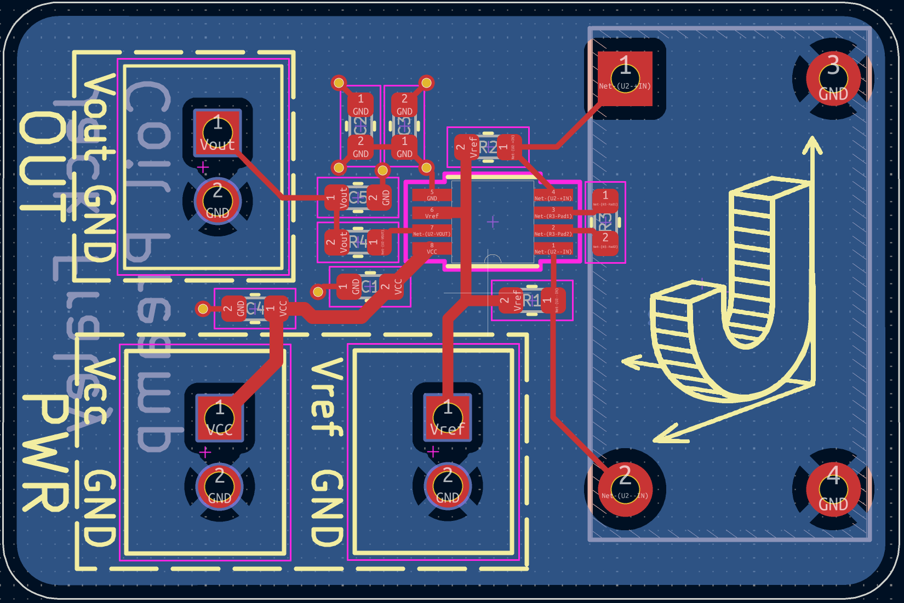

# Coil Array Block Project
This folder contains a KiCad hardware design for a magnetic-field sensing block.

## PCB Image

## Project
### CoilArrayBlock
Analog sensing block containing only:

- Current transformer front end: CWS CT-0705-HA (CT-0705-HA)
- Instrumentation amplifier stage: AD8422 (AD8422ARMZ)
- Input/output connector stage: JST B2B-XH-A (B2B-XH-A)

## Interfaces
- `Env_array_magfield`: magnetic field input to the sensing front end
- `Pwr_array_dcpwr`: `VCC` supply input
- `Pwr_array_vref`: `Vref` reference input
- `Array_sigproc_asig`: `Vout` analog signal output

## Repository Notes
This project includes KiCad source files (`.kicad_sch`, `.kicad_pcb`, `.kicad_pro`) and generated Gerbers.
Supporting documentation is included in `docs/`.
KiCad backup archives and local transient files are excluded via `.gitignore`.
